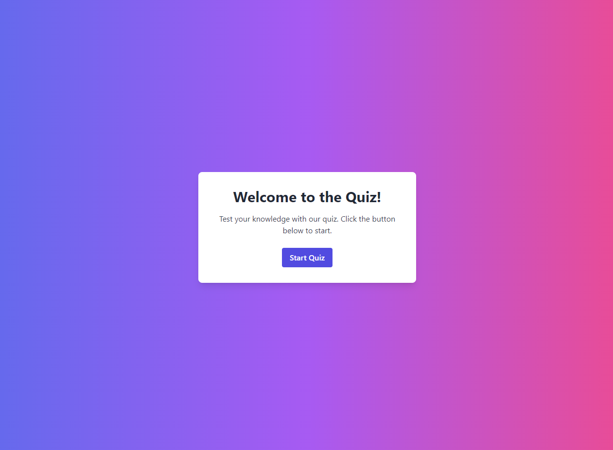

<h3>Quiz-Project</h3>

## More Content

Welcome to the Quiz App! This is a simple web application where users can test their knowledge on various topics.
The app presents a series of questions with multiple-choice answers, provides feedback on each answer, and displays the final score at the end of the quiz.

<h3>Table of Contents</h3>
1.Features 
 
2.Technologies Used
 
3.Getting Started
 
4.License
 

<h3>Features</h3>
User-friendly interface with a start screen, question display, and result summary. Randomized questions for each quiz session.
Immediate feedback on whether the selected answer is correct or incorrect. 
Detailed feedback at the end of the quiz, showing the user's answers and whether they were correct.
 

<h3>Technologies Used</h3>
1.HTML
2.CSS
3.JavaScript
